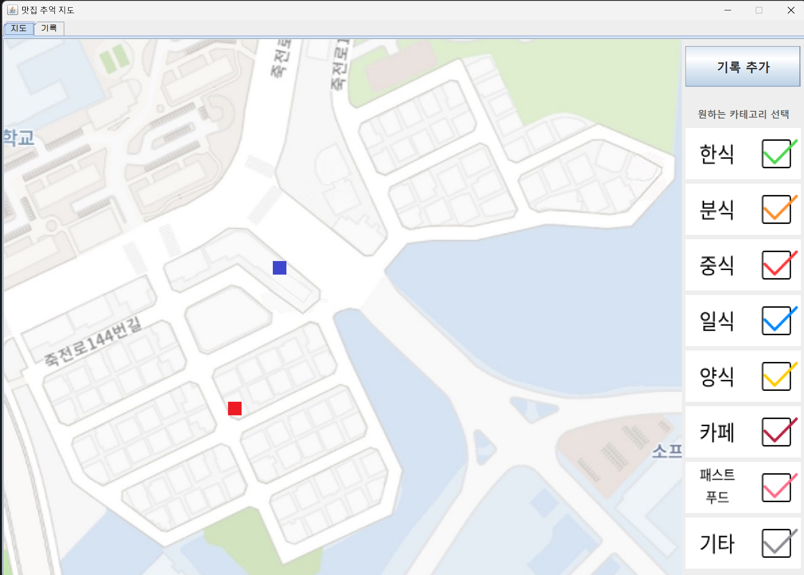
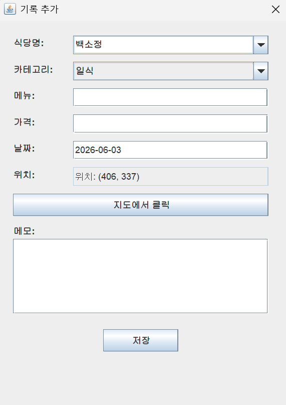
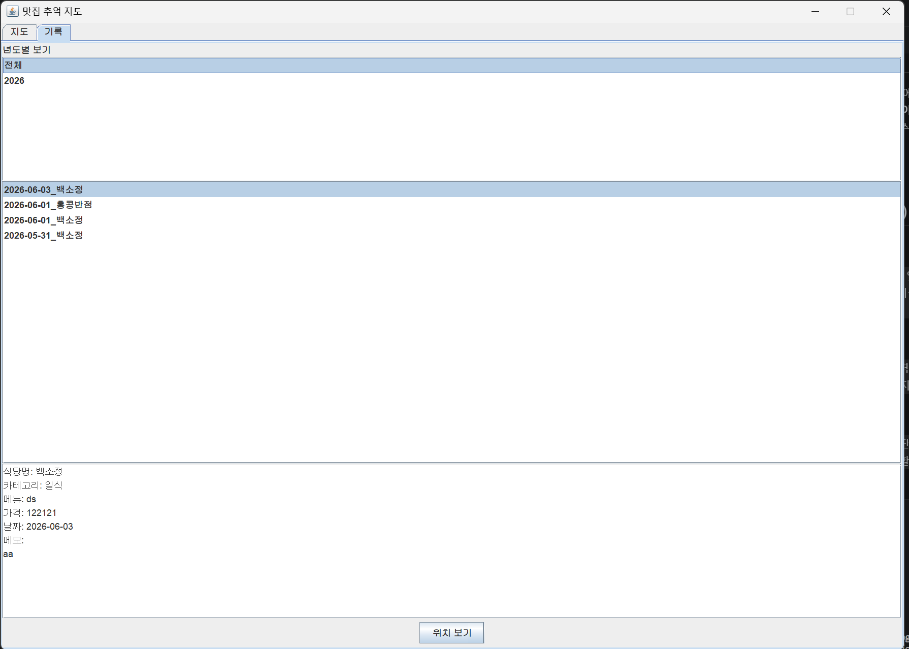

# 단대앞 맛집 추억 지도 (DKU Taste Map)

나만의 단국대학교 앞 맛집 방문 기록을 지도 위에 시각적으로 남기고 관리할 수 있는 **Java Swing 기반 데스크톱 애플리케이션**입니다.
우리 학교 앞 자주 가는 단골집의 위치, 메뉴, 가격, 그리고 생생한 식사 후기를 기록하여 즐거운 대학 생활의 추억을 간직해 보세요!

<br/>

## 화면 미리보기 (Screenshots)



> **단국대 맛집 지도 뷰 (Map View)**: 단국대학교 앞 거리가 담긴 고정 지도 위에 등록된 맛집들이 카테고리별 마커로 표시됩니다. **지도상의 아이콘을 클릭하면 해당 식당의 방문 기록을 바로 확인할 수 있으며**, 우측의 필터를 통해 원하는 종류의 식당만 골라볼 수 있습니다.



> **기록 추가 (Add Record)**: 식당 이름, 메뉴, 가격, 날짜, 메모를 작성하고 지도 위를 클릭하여 직관적으로 식당 위치를 지정할 수 있습니다.



> **기록 뷰 (Records View)**: 연도별로 방문했던 단대앞 맛집 리스트를 모아보고, 더블클릭하여 상세한 방문 메모를 확인할 수 있습니다.

<br/>

## 주요 기능 (Features)

- **단국대 맞춤형 지도 UI**: 단국대 앞 상권 지도를 고정 이미지로 사용하여, 외부 API 의존 없이 오프라인 환경에서도 빠르고 안정적으로 지리적 맥락을 파악할 수 있습니다.
- **마커 기반 인터랙션**: 지도 위의 각 식당 아이콘(마커)을 직접 클릭하여 해당 식당의 방문 기록을 즉시 열람할 수 있는 사용자 친화적 UI를 제공합니다.
- **카테고리 필터링**: 한식, 중식, 일식, 카페 등 8가지 카테고리별 토글 버튼을 제공하여 원하는 종류의 식당만 지도에 표시합니다.
- **상세한 기록 관리**: 특정 식당을 여러 번 방문하더라도 날짜별로 나누어 상세한 식사 후기와 메모를 기록할 수 있습니다.
- **로컬 파일 저장 (File I/O)**: 데이터베이스 연동 없이 로컬 텍스트 파일(`.txt`)을 활용하여 데이터를 가볍고 안전하게 저장하고 불러옵니다.
- **연도별 모아보기**: 탭 전환을 통해 특정 연도에 방문했던 기록들만 필터링하여 리스트업 할 수 있습니다.

<br/>

## 기술 스택 (Tech Stack)

- **Language**: Java (JDK 8+)
- **GUI Framework**: Java Swing & AWT
- **Data Storage**: Local File System (File I/O)

<br/>

## 프로젝트 구조 (Directory Structure)

- `Main.java` : 메인 프로그램 소스 코드
- `RestaurantRegistry.txt` : 식당별 카테고리 및 픽셀 좌표(X, Y) 데이터 저장소
- `Records/` : 개별 방문 기록 텍스트 파일이 저장되는 디렉토리
- `images/` : 애플리케이션 UI 및 지도 이미지 폴더
  - `지도.jpg` : 단국대 앞 메인 지도 배경 이미지
  - `location한식.jpg` 등 : 카테고리별 마커 아이콘 이미지
  - `한식checked.jpg` 등 : 필터 토글 버튼 활성화/비활성화 이미지

<br/>

## 실행 방법 (How to Run)

본 프로젝트는 어떠한 환경에서도 한글 깨짐 없이 실행되도록 UI 텍스트가 유니코드(Unicode) 이스케이프 처리되어 있습니다. 별도의 인코딩 설정 없이 표준 Java 명령어로 컴파일 및 실행이 가능합니다.

1. 터미널(또는 명령 프롬프트)을 열고 프로젝트 소스 코드가 있는 디렉토리로 이동합니다.
2. 아래 명령어를 순서대로 입력하여 컴파일 및 실행합니다.

```bash
# 소스 코드 컴파일
javac Main.java

# 프로그램 실행
java Main
```

_(참고: 정상적인 UI 출력을 위해 반드시 루트 경로에 `images` 폴더와 필요한 UI 이미지 파일들이 존재해야 합니다.)_

<br/>

## 주의점

- 컴파일러 및 IDE 설정 차이로 인한 **한글 깨짐 현상을 원천 방지하기 위해**, 소스 코드(`Main.java`) 내부의 모든 UI 텍스트(예: 버튼 이름, 탭 이름 등)는 **유니코드(`\uXXXX`)로 변환**되어 작성되었습니다.
